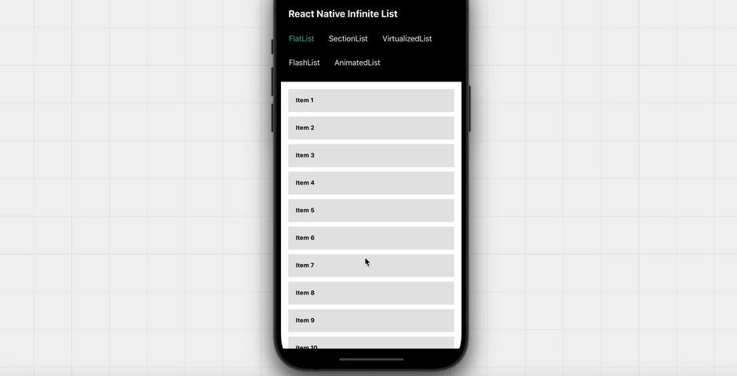

<h1 align="center">
  <br/>
  React Native Infinite List
</h1>

**React Native Infinite List** effortlessly loads more elements as users scroll down. As it is compatible with `FlatList`, `SectionList`, and any other list type, it stands as the ultimate solution for infinite scrolling.



## Features

- Ultimate Solution for Infinite Scrolling
- List Type Compatibility ([FlatList](https://swanstack.github.io/react-native-infinite-list/components/infinite-flat-list), [SectionList](https://swanstack.github.io/react-native-infinite-list/components/infinite-section-list), [VirtualizedList](https://swanstack.github.io/react-native-infinite-list/components/infinite-virtualized-list))
- Flexible Integration with Custom Lists and External Libraries ([read more](https://swanstack.github.io/react-native-infinite-list/builder/custom-infinite-list))

## Installation

```sh
yarn add @swanstack/react-native-infinite-list
```

## Usage

**Check [Docs](https://swanstack.github.io/react-native-infinite-list/usage) for more information!**

## Contributing

See the [contributing guide](CONTRIBUTING.md) to learn how to contribute to the repository and the development workflow.

## License

MIT

---

Made with [create-react-native-library](https://github.com/callstack/react-native-builder-bob)
